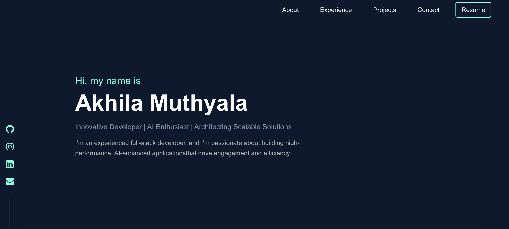
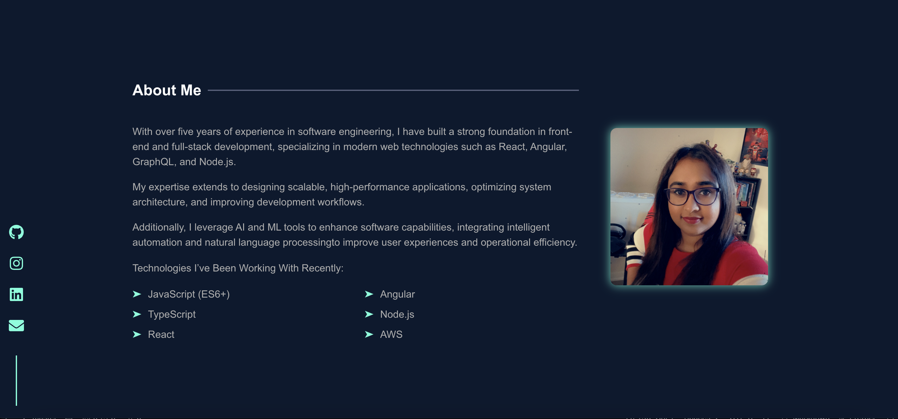
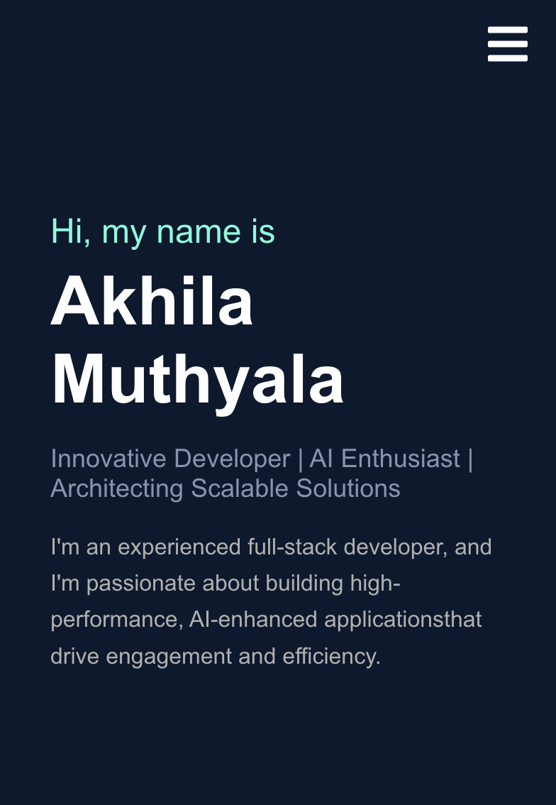
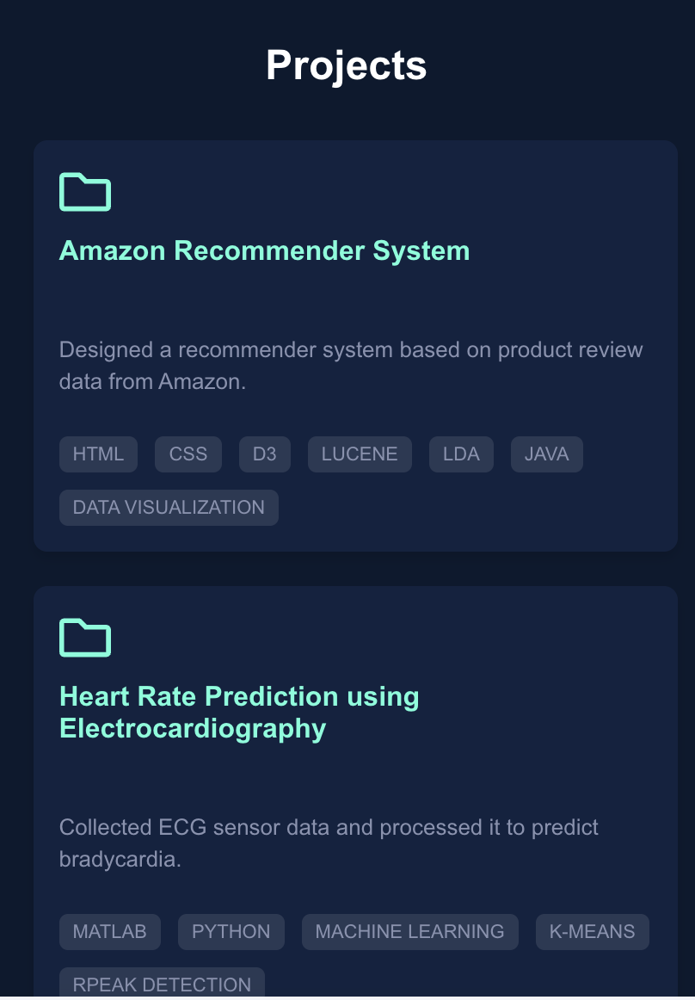

# 🚀 Akhila Muthyala - Portfolio

## 📌 Overview

https://amuthyal.github.io/my-portfolio/

This is my personal **portfolio website** showcasing my work, experience, projects, and technologies I’ve been working with. The website is built with **React** and styled using modern **CSS techniques** to ensure responsiveness across all devices.

It is currently **hosted on GitHub Pages** and will later be deployed on **AWS S3 + CloudFront** for improved performance and scalability.

I've used brittanychiang.com for design inspiration to build my personal website from scratch.

## 📸 Preview

### 🖥️ Desktop View




### 📱 Mobile View





---

## ⚙️ Tech Stack
- **Frontend**: React, JavaScript (ES6+), CSS, React Icons
- **State Management**: React Hooks
- **UI Components**: Styled Components, Flexbox & Grid Layout
- **Routing**: React Router
- **Deployment**: GitHub Pages (temporary), AWS S3 + CloudFront (final)
- **Domain Management**: AWS Route 53

---

## ✨ Features
✅ **Fully Responsive Design** - Works on desktop, tablet, and mobile devices  
✅ **Dynamic Experience Section** - Click on companies to view job details dynamically  
✅ **Projects Carousel** - Interactive project showcase with smooth navigation  
✅ **Dark Mode Theme** - Sleek and modern UI with neon blue highlights  
✅ **Custom Domain & Hosting** - Soon to be deployed on AWS for better performance  

---

## 🔧 Installation & Setup
To run the portfolio locally, follow these steps:

### **1️⃣ Clone the Repository**
```sh
git clone https://github.com/YOUR_USERNAME/YOUR_REPO_NAME.git
cd YOUR_REPO_NAME

2️⃣ Install Dependencies

npm install

3️⃣ Start the Development Server

npm start

The portfolio will be available at http://localhost:3000/.

🚀 Deployment

Temporary Hosting (GitHub Pages)

To deploy the website to GitHub Pages:

npm run deploy

Final Deployment (AWS S3 + CloudFront)

1. Build the project: npm run build
2. Upload build/ folder to AWS S3.
3. Configure AWS CloudFront for global delivery.
4. Set up Route 53 for a custom domain.

📩 Contact
Akhila Muthyala
📧 Email: your.email@example.com
🌐 Portfolio: yourcustomdomain.com
🔗 LinkedIn: linkedin.com/in/yourprofile
💻 GitHub: github.com/YOUR_USERNAME

🎉 Thanks for visiting! Let me know if you have any feedback. 😊🔥
